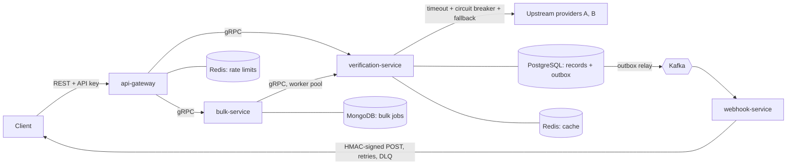

# PANic

**Don't panic. Your PAN is verified.**

A small identity verification (KYC) platform in Go, modelled on how KYC API
companies work: clients call a REST API to verify a PAN, singly or in bulk;
the platform checks unreliable upstream data providers with fallback, keeps
an audit trail without storing raw PII, and notifies clients by signed webhook.



## Services

| Service | Responsibility | Talks via | Owns |
|---|---|---|---|
| `api-gateway` | Public REST API: API-key auth, per-client rate limiting, request IDs, REST to gRPC | HTTP in, gRPC out | Redis `ratelimit:*` |
| `verification-service` | PAN checks: validation, idempotency, cache, provider orchestration, audit records, outbox | gRPC in, HTTP to providers | PostgreSQL `verification`, Redis `pan-lookup:*` |
| `bulk-service` | Bulk jobs through an autoscaling worker pool | gRPC in and out | MongoDB `bulk` |
| `webhook-service` | Delivers `verification.completed` events to clients with signatures, retries and a dead letter topic | Kafka in, HTTP out | — |
| `sandbox` | Fakes the outside world: flaky upstream providers and client webhook receivers | HTTP | — |

Each service owns its data; others reach it only through its API or events.

## Design decisions

**REST outside, gRPC inside.** Clients are other companies' servers in any language, so the public API is plain REST + JSON. Internal calls use gRPC for typed contracts, binary payloads and deadline propagation.

**Upstream resilience.** Every provider call has a hard timeout and its own circuit breaker (closed, open, half-open). The orchestrator tries providers in priority order. "PAN not found" is an answer and never triggers fallback; only errors do. When every provider is down the API returns `503 source_unavailable` quickly.

**Idempotency.** Clients send a `reference_id` (or an `Idempotency-Key` header). A retry returns the stored result with no new upstream call. A partial unique index on `(client_id, reference_id)` makes concurrent duplicates safe. Reusing a reference for a different PAN returns `409 reference_conflict`.

**PII.** Raw PANs are never stored or logged. Records hold a masked PAN (`AB******4F`) and an HMAC-SHA256 fingerprint with a secret key; a plain hash would be reversible by brute force because the PAN space is small. Cache keys and event payloads follow the same rules.

**Transactional outbox.** The verification record and its `verification.completed` event are written in one PostgreSQL transaction. A relay publishes outbox rows to Kafka using `FOR UPDATE SKIP LOCKED`, so several replicas can relay without publishing a row twice. If Kafka is down, the API keeps answering and events wait in the outbox.

**PostgreSQL for verifications, MongoDB for bulk jobs.** Verifications need a unique constraint for idempotency and a transaction spanning the record and the outbox: a natural fit for PostgreSQL. Bulk jobs are self-contained progress documents updated with atomic `$inc` counters. Cassandra would suit a much larger, multi-region audit log, but gives up the unique constraints and transactions this design relies on.

**Rate limiting.** Token bucket per client, stored in Redis and updated atomically by a Lua script, so all gateway replicas share one limit. Returns `429` with `Retry-After`. Fails open if Redis is unavailable.

**Webhooks.** Signed `t=<timestamp>,v1=<HMAC>` like Stripe, so receivers can verify authenticity and reject replays. At-least-once delivery with an `X-KYC-Event-ID` for deduplication. Retryable failures (network, timeout, 408, 429, 5xx) go to `webhook.retry` with exponential backoff and full jitter; permanent failures and exhausted retries go to `webhook.dlq`.

**Bulk jobs.** Answer `202 Accepted` immediately. Items flow through a bounded queue into a worker pool that grows and shrinks with the backlog, capped at the providers' concurrency limit. Every row gets a deterministic reference, so re-running a job never bills twice. Progress is tracked with atomic counters.

## Running it

Requirements: Go 1.23+, Docker.

**Everything in Docker:**

```bash
docker compose --profile apps up -d --build
```

**Infrastructure in Docker, services with `go run`** (faster to iterate):

```bash
docker compose up -d     # postgres, mongo, redis, kafka
go run ./services/sandbox
PII_SECRET=dev-secret go run ./services/verification-service/cmd
go run ./services/bulk-service/cmd
go run ./services/webhook-service/cmd
go run ./services/api-gateway/cmd
```

Docker PostgreSQL and MongoDB listen on host ports 5433 and 27018 so they don't clash with local installations.

**Kubernetes:** with a local cluster (e.g. Docker Desktop's) and [Tilt](https://tilt.dev), run `tilt up`. Manifests are in `deploy/k8s`.

## Try it

Demo API keys are in [`deploy/dev/README.md`](deploy/dev/README.md).

```bash
KEY=live_bank1_demo_9f3a2c7e

# Verify a PAN
curl -s -X POST localhost:8080/v1/verifications/pan \
  -H "Authorization: Bearer $KEY" \
  -d '{"pan":"ABCDE1234F","name":"Shayan Dutta","reference_id":"order-1"}'

# Same reference again: same result, no new upstream call
# Same reference, different PAN: 409 reference_conflict

# Bulk job, then poll it
curl -s -X POST localhost:8080/v1/bulk-jobs -H "Authorization: Bearer $KEY" \
  -d '{"items":[{"pan":"ABCDE0001F"},{"pan":"ABCDE0002X"}]}'
curl -s localhost:8080/v1/bulk-jobs/<id> -H "Authorization: Bearer $KEY"

# Webhooks received by the demo client
curl -s localhost:8090/client-webhooks/bank-1
```

PANs ending in `X` don't exist in the sandbox; any other valid PAN does.

**Break things on purpose:**

```bash
# Provider A down: requests fall back to B, then A's breaker opens
curl -X PUT localhost:8090/admin/sources/source-a -d '{"fail_rate":1,"latency_ms":10}'

# Client webhook endpoint down: watch retries with backoff, then recovery
curl -X PUT localhost:8090/admin/client-webhooks/bank-1 -d '{"fail_status":503}'
curl -X PUT localhost:8090/admin/client-webhooks/bank-1 -d '{"fail_status":0}'

# Kafka down: the API keeps working, events wait in the outbox
docker compose stop kafka   # ...make requests...
docker compose start kafka  # webhooks arrive
```

## Tests

```bash
make test               # unit tests
make test-race          # with the race detector
make test-integration   # also runs PostgreSQL tests against the compose database
```

## Layout

```
proto/                    gRPC contracts (generated code in shared/proto)
shared/                   contracts, PII helpers, circuit breaker, kafka, webhook signing, db
services/
  api-gateway/            REST API, auth, rate limiting
  verification-service/   domain, service, orchestrator, sources, repository, cache, outbox, grpcapi
  bulk-service/           worker pool, processor, repository, grpcapi
  webhook-service/        delivery (sender, retry policy), dispatcher
  sandbox/                fake providers and webhook receivers
deploy/                   demo config, docker webhook config, kubernetes manifests
```

## Known limitations and next steps

- Bulk items are held in memory while queued, so a restart drops unfed items (the job stays `RUNNING`). Persisting items encrypted would allow resuming.
- Webhook retries wait on the head of a single retry topic; larger systems use several fixed-delay retry topics.
- API keys and webhook endpoints are loaded from files; production would use an admin API backed by a database.
- Field-level envelope encryption with a KMS, mTLS between services, and OpenTelemetry tracing are not implemented yet.
- The Kubernetes manifests are structurally validated but haven't been applied to a cluster in this repo.
- Hedged requests across providers would further cut tail latency.

## License

[MIT](LICENSE) © 2026 Shayan Dutta. Free to use and adapt; keep the copyright notice.
